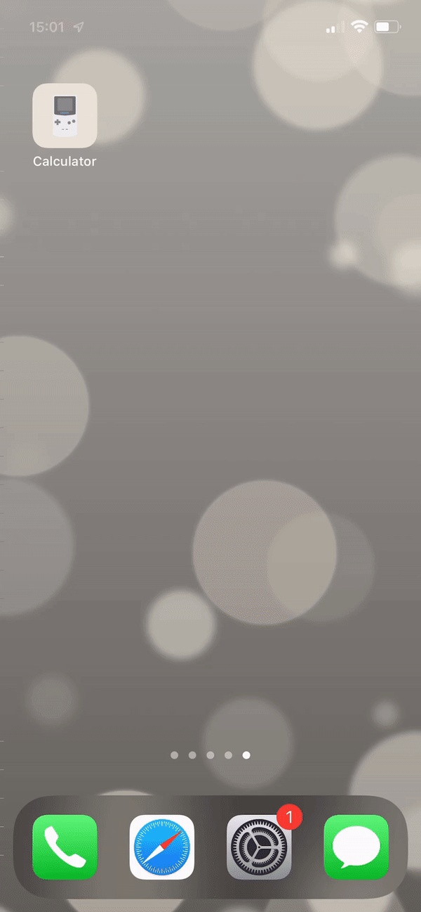

# iOS Simple Calculator

 
Calculator applications is a simple application developed in the Swift language using the Xcode environment. The calculator allows you to use simple arithmetic operations

# Languages and Tools

  

# Preview

