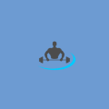

# iOS Gym Without storyboard

 
Приложение Gym разработано с минимальной поддерживаемой версией iOS 13 и под iPhone 12 на основе задания Gym регионального чемпионата города Москвы.

# Languages and Tools

# Preview

